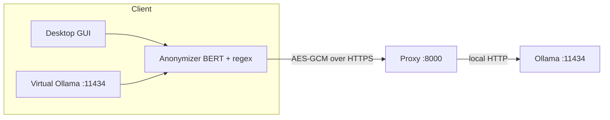

# Pukara

**Pukara** is a privacy-first, self-hosted gateway for local large language
models ([Ollama](https://ollama.com)). It runs a Dockerized Ollama server behind
an application-layer encryption proxy, and ships a desktop client that
**anonymizes sensitive entities on-device** (BERT + regex) before anything
leaves the machine.

The name *Pukara* (Quechua for "fortress") plays on Ollama's alpaca: a small,
resilient stronghold around your model.

> **Language focus.** Pukara's anonymization is tuned for **Spanish** text, where
> we found a gap in privacy tooling. It is model-agnostic: point `BERT_MODEL` to a
> different NER checkpoint to support other languages.

## Features

- Dockerized Ollama server behind an **AES-256-GCM** encryption proxy (rotating key).
- On-device **anonymization** with BERT (`bsc-bio-ehr-es-carmen-anon`) + regex.
- Desktop GUI that auto-detects your IP and starts/stops the local Ollama endpoint.
- Ollama-compatible endpoint (`local_ollama.py`) for VS Code, Codex, Open WebUI, etc.
- Hardened image: non-root user, read-only filesystem, dropped capabilities.

## Architecture



- The **client** detects entities (names, dates, phones, addresses…) and replaces
  them with reversible placeholders `[TAG_n]`; the `placeholder → real` map never
  leaves the client.
- The **proxy** decrypts requests, forwards them to Ollama and encrypts responses.
- **Ollama** listens only on `127.0.0.1:11434` inside the container.

## Encryption

The effective key is derived from a shared secret plus a 5-minute time window:

```
key = HMAC-SHA256(secret, "ollama-secure:{window}")
window = unix_timestamp // 300
```

Authenticated encryption with **AES-256-GCM**. A clock skew of ±1 window
(10 minutes) between client and server is tolerated.

## Anonymization

```
text → detect entities (BERT + regex) → replace with [TAG_n] → encrypt → send
response → decrypt → restore real values → show
```

The BERT model is configured via `BERT_MODEL` (a gated Hugging Face repo),
defaulting to `PlanTL-GOB-ES/bsc-bio-ehr-es-carmen-anon`.

### Detection quality

The detection engine is the pipeline of
[carmina3](readme_carmina3.md), a Spanish clinical-text de-identification
suite. Its calibrated strategy reports the following on the **CARMEN** test set
(2,000 documents):

| Level | Precision | Recall | F1 |
|---|---|---|---|
| Word (PHI vs non-PHI) | 0.930 | 0.919 | **0.924** |
| Document (macro F1, mean/doc) | — | — | 0.724 |

Document-level leakage (documents with at least one missed PHI among critical
tags such as `EMAIL`, `FAMILY`, `NAME`, `ID`, `PHONE`, `URL`, `PROFESSIONAL`):
**2.5%** (49 / 2000). Throughput: 2,000 documents in about 5 minutes on CPU.

See [`readme_carmina3.md`](readme_carmina3.md) for the full evaluation details.

## Repository structure

```
├── proxy.py            # Encrypted proxy (server)
├── secure.py           # AES-GCM with rotating key (shared)
├── entrypoint.sh       # Container bootstrap (Ollama + model + proxy)
├── Dockerfile
├── docker-compose.yml
├── client_app.py       # Desktop client (Tkinter GUI)
├── local_ollama.py     # Local Ollama-compatible endpoint -> remote proxy
├── client.py           # CLI test client
├── anonymizer.py       # BERT + regex anonymization (reversible placeholders)
├── lista_blanca.txt    # Whitelist of terms not to anonymize
├── requirements.txt    # Client dependencies
├── tests/              # pytest suite
└── .github/workflows/  # CI (tests + image build)
```

## Requirements

- **Server**: Docker + Docker Compose.
- **Client**: Python 3.9+ with `cryptography`; for anonymization also
  `torch`, `transformers` and `numpy` (see `requirements.txt`).

## Installation

### Server (Docker)

```bash
cp .env.example .env   # set ENCRYPTION_SECRET, AUTH_*, ALLOWED_IPS, OLLAMA_MODEL
docker compose up --build
```

### Client

```bash
pip install -r requirements.txt
cp .env.example .env   # server URL + the same shared secret
python client_app.py   # or run_client.bat (Windows) / run_client.sh (Linux)
```

## Usage

### Desktop client

When `client_app.py` opens:

1. Checks the BERT model in `models/` (downloads it if missing).
2. Runs minimal system checks.
3. Shows the configuration pre-filled from `.env` and auto-detects your IP.
4. **Start**: pings the server (`/health` → 200) and opens the chat.
5. Starts `local_ollama.py` so VS Code / Codex / etc. can connect.
6. **Stop** (or closing the window) stops the local Ollama endpoint.

### Local Ollama endpoint (VS Code, Codex, Open WebUI…)

```bash
python local_ollama.py
```

Point your tools at `http://127.0.0.1:11434`. Every request is anonymized before
being encrypted and forwarded.

### CLI client

```bash
python client.py --url https://your-app.sliplane.app --model llama3.2:3b
```

## Configuration

Environment variables (in `.env` locally, in the provider's panel in production):

| Variable | Description |
|---|---|
| `OLLAMA_MODEL` | Ollama model to download |
| `OLLAMA_KEEP_ALIVE` | Keep the model in memory (`-1` = always) |
| `ENCRYPTION_SECRET` | Shared secret for encryption (required) |
| `AUTH_USER` | Proxy username (Basic Auth) |
| `AUTH_PASSWORD` | Proxy password (Basic Auth) |
| `ALLOWED_IPS` | Allowed client IPs, comma-separated (CIDR supported) |
| `BERT_MODEL` | Hugging Face repo of the anonymization model |
| `PROXY_PORT` | Proxy port (default `8000`) |
| `LOCAL_PORT` | Local virtual-Ollama port (default `11434`) |

## Deploying (e.g., Sliplane)

1. Push this repository to GitHub.
2. Create a service connected to the repo.
3. Configure port `8000`, a persistent volume at `/home/app/.ollama`, and the
   environment variables above.
4. Deploy. You will get a public HTTPS URL.

## Security

- HTTPS at the edge plus **application-layer encryption** (AES-GCM) both ways.
- Ollama **not exposed** (only `127.0.0.1:11434` inside the container).
- **Hardened** image: non-root user, read-only filesystem, `cap_drop: ALL`,
  `no-new-privileges`.
- The secret lives in `.env` (local, untracked) and in the provider's secret
  store; it is never baked into the image.
- The proxy enforces **Basic Auth** and an **IP allowlist**.
- Anonymization ensures the server **never receives personal data**: it only
  sees placeholders it cannot reverse.

## Tests

```bash
pip install -r requirements-dev.txt
python -m pytest -q
```

Tests cover `secure.py`, `anonymizer.py`, `proxy.py` and `local_ollama.py`
without downloading the BERT model.

## Citation

If you use Pukara, please cite it using [`CITATION.cff`](CITATION.cff).

## License

MIT. See [`LICENSE`](LICENSE).
