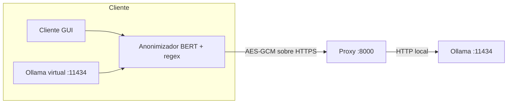

# Ollama Privado Cifrado

Servidor **Ollama** autocontenido en Docker con un **proxy de cifrado** delante y
un **cliente de escritorio** que anonimiza entidades sensibles con **BERT** y
**expresiones regulares** antes de enviar los datos al servidor.

La comunicación se cifra en la aplicación con **AES-256-GCM** y una clave que rota
cada 5 minutos (además del HTTPS del despliegue). El servidor **nunca recibe los
datos reales**: el cliente los sustituye por placeholders y solo el cliente puede
revertirlos.

## Características

- Servidor Ollama en Docker, listo para desplegar en Sliplane u otro proveedor.
- Proxy de cifrado AES-GCM con clave rotatoria, Basic Auth y lista blanca de IPs.
- Cliente de escritorio (GUI) que detecta tu IP y arranca/para el Ollama local.
- Anonimización local con BERT (`bsc-bio-ehr-es-carmen-anon`) + regex.
- Endpoint compatible con Ollama (`local_ollama.py`) para VS Code, Codex, Open WebUI, etc.
- Imagen Docker endurecida: usuario no-root, FS de solo lectura y sin capacidades.

## Arquitectura



- El **cliente** detecta entidades (nombres, fechas, teléfonos, direcciones…) y
  las sustituye por placeholders `[ETIQUETA_n]`; el mapa `placeholder → real`
  vive solo en el cliente.
- El **proxy** descifra la petición, la reenvía a Ollama y cifra la respuesta.
- **Ollama** escucha solo en `127.0.0.1:11434`, nunca expuesto al exterior.

## Cifrado

La clave efectiva se deriva de un **secreto compartido** + la **ventana de tiempo**
de 5 minutos:

```
key = HMAC-SHA256(secreto, "ollama-secure:{ventana}")
ventana = timestamp_unix // 300
```

Cifrado autenticado con **AES-256-GCM**. Se tolera un desfase de reloj de
±1 ventana (10 minutos) entre cliente y servidor.

## Estructura del repositorio

```
├── proxy.py            # Proxy cifrado (servidor)
├── secure.py           # AES-GCM con clave rotatoria (compartido)
├── entrypoint.sh       # Arranque del contenedor (Ollama + modelo + proxy)
├── Dockerfile
├── docker-compose.yml
├── client_app.py       # Cliente de escritorio (GUI, Tkinter)
├── local_ollama.py     # Endpoint Ollama local -> proxy remoto cifrado
├── client.py           # Cliente CLI de prueba
├── anonymizer.py       # Anonimización BERT + regex (placeholders reversibles)
├── lista_blanca.txt    # Términos que no se anonimizan
├── requirements.txt    # Dependencias del cliente
├── tests/              # Tests pytest
└── .github/workflows/  # CI (tests + build de imagen)
```

## Requisitos

- **Servidor**: Docker + Docker Compose.
- **Cliente**: Python 3.9+ con `cryptography`; para anonimizar, además
  `torch`, `transformers` y `numpy` (ver `requirements.txt`).

## Instalación

### Servidor (Docker)

```bash
cp .env.example .env   # edita ENCRYPTION_SECRET, AUTH_*, ALLOWED_IPS, OLLAMA_MODEL
docker compose up --build
```

### Cliente

```bash
pip install -r requirements.txt
cp .env.example .env   # URL del servidor + mismo secreto compartido
python client_app.py   # o run_client.bat (Windows) / run_client.sh (Linux)
```

## Uso

### Cliente de escritorio

Al abrir `client_app.py`:

1. Comprueba que el modelo BERT está en `models/` (si no, intenta descargarlo).
2. Ejecuta unas comprobaciones mínimas del sistema.
3. Muestra la configuración precargada de `.env` y detecta tu IP.
4. Con **Arrancar**: hace ping al servidor (`/health` → 200) y abre el chat.
5. Levanta `local_ollama.py` para que VS Code / Codex / etc. se conecten.
6. Con **Parar** o al cerrar la ventana, detiene el Ollama local.

### Endpoint Ollama local (VS Code, Codex, Open WebUI…)

```bash
python local_ollama.py
```

Deja el proceso corriendo y apunta tus herramientas a `http://127.0.0.1:11434`.
Toda petición que pase por ahí se anonimiza antes de cifrarse.

### Cliente CLI

```bash
python client.py --url https://tu-app.sliplane.app --model llama3.2:3b
```

## Anonimización

```mermaid
flowchart LR
    A[Texto real] --> B[Detectar entidades: BERT + regex]
    B --> C[Sustituir por [ETIQUETA_n]]
    C --> D[Cifrar y enviar]
    D --> E[Respuesta con placeholders]
    E --> F[Restaurar valores reales]
    F --> G[Mostrar al usuario]
```

El modelo BERT usado se configura con la variable `BERT_MODEL` (repo de
Hugging Face). Por defecto: `PlanTL-GOB-ES/bsc-bio-ehr-es-carmen-anon`.

## Configuración

Variables de entorno (en `.env` para local, en el panel de Sliplane para prod):

| Variable            | Descripción                                          |
|---------------------|------------------------------------------------------|
| `OLLAMA_MODEL`      | Modelo de Ollama a descargar                         |
| `OLLAMA_KEEP_ALIVE` | Mantener el modelo en memoria (`-1` = siempre)       |
| `ENCRYPTION_SECRET` | Secreto compartido para el cifrado (obligatorio)     |
| `AUTH_USER`         | Usuario del proxy (Basic Auth)                       |
| `AUTH_PASSWORD`     | Contraseña del proxy (Basic Auth)                    |
| `ALLOWED_IPS`       | IPs permitidas, separadas por comas (admite CIDR)    |
| `BERT_MODEL`        | Repo de Hugging Face del modelo de anonimización     |
| `PROXY_PORT`        | Puerto del proxy (defecto `8000`)                    |
| `LOCAL_PORT`        | Puerto local del Ollama virtual (defecto `11434`)    |

## Desplegar en Sliplane

1. Sube este repositorio a GitHub.
2. En Sliplane, crea un servicio conectado al repositorio.
3. Configura:
   - **Puerto**: `8000`.
   - **Volumen persistente** en `/home/app/.ollama` (para no redescargar el modelo).
   - **Variables de entorno**: `OLLAMA_MODEL`, `ENCRYPTION_SECRET`, `AUTH_USER`,
     `AUTH_PASSWORD`, `ALLOWED_IPS`.
4. Despliega. Obtendrás una URL pública HTTPS.

Probar el despliegue:

```bash
python client.py --url https://tu-app.sliplane.app --model llama3.2:3b
```

## Seguridad

- HTTPS en el despliegue + **cifrado de aplicación** AES-GCM en ambos sentidos.
- Ollama **sin exponer** (solo `127.0.0.1:11434` dentro del contenedor).
- Imagen **endurecida**: usuario no-root, sistema de ficheros de solo lectura,
  `cap_drop: ALL` y `no-new-privileges`.
- El secreto vive en `.env` (local, no versionado) y en las variables de
  entorno/secretos del proveedor. Nunca se hornea en la imagen.
- El proxy exige **Basic Auth** y **lista blanca de IPs**.
- La anonimización garantiza que el servidor **no reciba datos personales**:
  recibe placeholders y no puede revertirlos.

## Tests

```bash
pip install -r requirements-dev.txt
python -m pytest -q
```

Los tests cubren `secure.py`, `anonymizer.py`, `proxy.py` y `local_ollama.py`
sin necesidad de descargar el modelo BERT.

## Citar

Si usas este software, cítalo usando la información de [`CITATION.cff`](CITATION.cff).

## Licencia

MIT. Ver [`LICENSE`](LICENSE).
