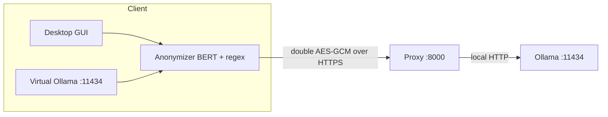

# Pukara

<p align="center">
  
</p>

[](https://github.com/ramsestein/pukara/actions/workflows/ci.yml)
[]()
[](LICENSE)
[]()

A privacy-first, self-hosted gateway for local large language models
([Ollama](https://ollama.com)). Pukara runs a Dockerized Ollama server behind an
application-layer encryption proxy, and ships a desktop client that **anonymizes
sensitive entities on-device** (BERT + regex) before anything leaves the machine.

The name *Pukara* (Quechua for "fortress") plays on Ollama's alpaca: a small,
resilient stronghold around your model.

## Software metadata

| Field | Value |
|---|---|
| Name | Pukara |
| Version | 0.1.0 |
| License | [MIT](LICENSE) |
| Language | Python 3.9+ |
| Dependencies | `cryptography`, `torch`, `transformers`, `numpy`, `huggingface_hub` |
| Repository | https://github.com/ramsestein/pukara |
| CI | [GitHub Actions](.github/workflows/ci.yml) |

## Abstract

Pukara addresses the gap between self-hosted LLMs and privacy: it encrypts the
whole client–server channel with **AES-256-GCM** (rotating key) and
**anonymizes personal data on the client** before transmission, so the server
only ever sees reversible placeholders it cannot undo. It is designed for
**Spanish** text, where privacy tooling is scarce, and is model-agnostic (swap
`BERT_MODEL` for another language).

## Motivation and significance

- Local models are increasingly self-hosted, but the transport and the payload
  are rarely protected end-to-end.
- Clinical and personal Spanish text has few ready-to-use anonymization tools.
- Pukara packages encryption + on-device NER anonymization + a turnkey
  Ollama-compatible endpoint, so existing tools (VS Code, Codex, Claude Code)
  work without changes.

## Software architecture



Encryption is **double-layered** (two independent AES-256-GCM layers):

1. **Message**: the request/response body is encrypted with a key derived from
   the shared secret plus a 5-minute time window:
   `key = HMAC-SHA256(secret, "ollama-secure:{window}")`.
2. **Credentials**: the Basic Auth credentials are encrypted separately with a
   second key derived from the sum of the model name, the BERT model name and
   the auth password, so they never travel in the clear:
   `key = HMAC-SHA256(SHA-256(model | bert_model | auth_password), "pukara-auth:{window}")`.

```
window = unix_timestamp // 300
```

See [`docs/installation.md`](docs/installation.md) and
[`docs/client.md`](docs/client.md) for the full details.

## Functionality

- Dockerized Ollama server behind an encrypted proxy (double encryption, IP allowlist, rate limiting, anti-replay).
- On-device anonymization (BERT `bsc-bio-ehr-es-carmen-anon` + regex).
- Desktop GUI with auto-detected IP and start/stop of the local endpoint.
- Ollama/OpenAI-compatible local endpoint for external tools.

## Installation

Installation (server and client) is documented in
[`docs/installation.md`](docs/installation.md).

## Usage

- Desktop client and CLI: [`docs/client.md`](docs/client.md).
- VS Code, Codex CLI and Claude Code: [`docs/integrations.md`](docs/integrations.md).

## Security

See [`docs/SECURITY.md`](docs/SECURITY.md) for the security model, hardening and how to
report vulnerabilities.

## Evaluation

Anonymization metrics (CARMEN, MedDocAn) are reported in
[`docs/metrics.md`](docs/metrics.md). Highlights: word-level F1 **0.924** on
CARMEN, document-level leakage **2.5%**.

## Tests

```bash
pip install -r requirements-dev.txt
python -m pytest -q
```

Tests cover `secure.py`, `anonymizer.py`, `proxy.py` and `local_ollama.py`
without downloading the BERT model.

## Citation

If you use Pukara, please cite it using [`CITATION.cff`](CITATION.cff).

## License

MIT. See [`LICENSE`](LICENSE).
