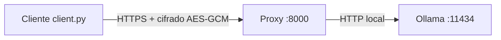

# Ollama propio en Docker (para desplegar en Sliplane)

Contenedor de [Ollama](https://ollama.com) con un **proxy de cifrado** delante.
Al arrancar: levanta Ollama (solo accesible internamente), descarga el modelo y
expone un proxy que cifra/descifra toda la comunicación en ambos sentidos.

## Arquitectura



- `client.py` cifra la petición con una clave que **rota cada 5 minutos**.
- El proxy descifra, reenvía a Ollama y cifra la respuesta de vuelta.
- Ollama escucha solo en `127.0.0.1:11434`, nunca expuesto al exterior.

## Cifrado

La clave efectiva se deriva de un **secreto compartido** + la **ventana de tiempo**
de 5 minutos:

```
key = HMAC-SHA256(secreto, "ollama-secure:{ventana}")
ventana = timestamp_unix // 300
```

Cifrado autenticado con **AES-256-GCM**. Se tolera un desfase de reloj de
+/- 1 ventana (10 minutos) entre cliente y servidor.

## Requisitos

- Docker (y Docker Compose para la prueba local)
- Python 3 + `cryptography` para el cliente (`pip install cryptography`)
- Un repositorio de GitHub (Sliplane lo despliega desde ahí)

## Configuración

Variables de entorno (en `.env` para local, en el panel de Sliplane para prod):

| Variable            | Descripción                                        |
|---------------------|----------------------------------------------------|
| `OLLAMA_MODEL`      | Modelo a descargar (defecto `gemma2:2b`)           |
| `ENCRYPTION_SECRET` | Secreto compartido para el cifrado (obligatorio)   |
| `AUTH_USER`         | Usuario de acceso al proxy (Basic Auth)            |
| `AUTH_PASSWORD`     | Contraseña del proxy (Basic Auth)                  |
| `ALLOWED_IPS`       | IPs permitidas, separadas por comas (admite CIDR)  |
| `PROXY_PORT`        | Puerto del proxy (defecto `8000`)                  |

Copia la plantilla y edítala (el `.env` no se sube a git):

```bash
cp .env.example .env
```

## Probar localmente

```bash
docker compose up --build
```

- Proxy cifrado: `http://localhost:8000`
- Ollama directo (solo local): `http://localhost:11434`

Con el cliente cifrado:

```bash
pip install cryptography
python client.py --url http://localhost:8000 --model gemma3:270m
```

O directamente con `curl` al endpoint local sin cifrar (solo desarrollo):

```bash
curl http://localhost:11434/api/tags
```

## Modelo

Por defecto se descarga `gemma2:2b` (~1.6 GB). Nota: ni `gemma4:2b` ni
`gemma3:2b` existen en el catálogo de Ollama (Gemma 3 solo está en 1B, 4B, 12B y
27B). Alternativas: `gemma3:270m`, `gemma3:1b`, `gemma3:4b`, `llama3.2:3b`, etc.

## Desplegar en Sliplane

1. Sube este repositorio a GitHub.
2. En Sliplane, crea un servicio y conéctalo a tu repositorio
   (ahí introduces las credenciales de acceso a GitHub).
3. Configura el servicio:
   - **Build**: detecta automáticamente el `Dockerfile` en la raíz.
   - **Puerto**: `8000` (el proxy; `11434` queda interno).
   - **Volumen persistente**: monta uno en `/root/.ollama` para no
     redescargar el modelo en cada reinicio.
   - **Variables de entorno**:
     - `OLLAMA_MODEL=gemma3:270m` (o el que quieras)
     - `ENCRYPTION_SECRET=<tu secreto>`
     - `AUTH_USER=admin`
     - `AUTH_PASSWORD=<tu contraseña>`
     - `ALLOWED_IPS=203.229.141.235` (tu IP pública)
4. Despliega. Obtendrás una URL pública HTTPS, p. ej.
   `https://tu-app.sliplane.app`.

Probar el despliegue con el cliente cifrado:

```bash
python client.py --url https://tu-app.sliplane.app --model gemma3:270m
```

## Seguridad

- Sliplane expone la app con **HTTPS**.
- El proxy añade **cifrado de aplicación** (AES-GCM con clave rotatoria) en
  ambos sentidos, además del HTTPS.
- Ollama queda **sin exponer** (solo `127.0.0.1:11434`).
- El secreto vive en `.env` (local, no versionado) y en las variables de
  entorno/secretos de Sliplane. No lo subas nunca al repositorio.
- El proxy exige **usuario/contraseña** (Basic Auth) y **lista blanca de IPs**
  (`ALLOWED_IPS`). Configúralos en Sliplane igual que en tu `.env`.
- La IP del cliente se lee de `X-Forwarded-For` (lo reenvía el router de
  Sliplane). Si tu IP pública es dinámica, tendrás que actualizar `ALLOWED_IPS`
  cuando cambie.

## Notas de rendimiento

Sliplane suele ofrecer solo CPU. Los modelos pequeños (`gemma3:270m`,
`gemma3:1b`) responden rápido; `gemma2:2b` funciona en CPU con latencia mayor.
Revisa si tu plan incluye instancias con GPU para modelos más grandes.
