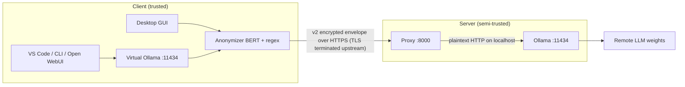

# Pukara — Threat model

This document is the authoritative description of what Pukara protects, against
whom, under which assumptions, and — just as importantly — what it does **not**
protect. It is cited from the README and `docs/SECURITY.md`.

Every mitigation in the STRIDE table references the test that covers it.

## 1. Assets

| Asset | Where it lives | Confidentiality impact if exposed |
|---|---|---|
| Original text containing PHI (names, IDs, addresses, dates, clinical narrative) | Client memory only | High |
| Placeholder → real text map | Client memory only (never persisted, never sent) | High — it is the re-identification key |
| `ENCRYPTION_SECRET` (PSK) | Environment / `.env` on client and server | High — decrypts the whole channel |
| Credentials (`AUTH_USER`, `AUTH_PASSWORD`) | Environment / `.env` | Medium — allows impersonating an allowed tenant |
| NER model weights (`BSC-NLP4BIA/bsc-bio-ehr-es-carmen-anon`) | Client disk (`models/`) | Medium — enables targeted attacks against the detector |
| LLM responses | Server ↔ client channel | High — clinical content can travel back |
| Audit log (`AUDIT_LOG`) | Server disk | Medium — metadata about requests; never bodies |

## 2. Actors and capabilities

| Actor | Capabilities |
|---|---|
| Passive network observer | Reads packets on any link (if TLS is terminated upstream, reads plaintext there) |
| Active network attacker | Modifies, drops, replays, injects packets; MITM |
| PaaS / reverse proxy that terminates TLS | **Sees the plaintext HTTP that leaves Pukara's client** — this is the real justification for the application-layer encryption |
| Honest-but-curious server | Runs the proxy correctly but logs/inspects what it can |
| Compromised server | Full control of proxy and Ollama; can read memory and keys |
| Compromised client | Full control of the endpoint: reads the original text, the map, the PSK |
| Supply-chain attacker | Tampers with Hugging Face model, PyPI packages, or the Docker image |
| Malicious webpage (browser) | Sends cross-origin requests to `http://127.0.0.1:11434` |

## 3. Trust boundaries

- The **trust boundary** between the client and the proxy is the encrypted
  channel (`src/secure.py`): the client does not trust the PaaS/reverse proxy
  that terminates TLS.
- The proxy trusts Ollama only over `127.0.0.1:11434`.
- The client is the only component that ever holds the placeholder map.

## 4. Assumptions

1. Client and server clocks are synchronized within `MAX_SKEW` (default 120 s).
2. The client endpoint is trustworthy (not compromised).
3. `ENCRYPTION_SECRET` is distributed out of band and never travels over the
   channel it protects.
4. The server operator is not the adversary for the *transport* layer (they are
   the adversary only for the *payload* layer — see §2).
5. The NER model weights are verified against `BERT_MODEL_SHA256` at load.

## 5. STRIDE per component

Abbreviations: `test_secure.py` (S), `test_proxy.py` (P), `test_anonymizer.py`
(A), `test_local_ollama.py` (L).

### 5.1 Anonymizer (`src/anonymizer.py`)

| Threat | Mitigation | Test | Residual risk |
|---|---|---|---|
| Spoofing (fake model) | SHA-256 verification of weights (`verify_model_hash`) | `A::test_verify_model_hash` | Fail-open if `BERT_MODEL_SHA256` unset (default `.env.example` pins it) |
| Tampering with the map | Map lives only in client memory, `reset()` per conversation | `A::test_reset_clears_maps` | Compromised client reads the map regardless |
| Information disclosure (missed PHI) | BERT + regex detection | `A::test_regex_detects_entities`, `A::test_map_*` | Recall < 1: missed entities are sent in the clear — see §6 |
| Denial of service | None | — | A malicious prompt can make detection slow |
| Elevation of privilege | N/A (no privilege model) | — | — |

### 5.2 Virtual Ollama (`src/local_ollama.py`)

| Threat | Mitigation | Test | Residual risk |
|---|---|---|---|
| Spoofing (foreign web page) | Reject non-local `Origin` (CORS) | `L::test_foreign_origin` | DNS rebinding against `localhost` hostnames |
| Tampering (model management) | Deny management routes | `L::test_is_management_path` | Local processes are trusted |
| Information disclosure (streaming) | Force `stream=false`, single chunk | `L::test_*_anonymized` | Documented limitation (see `docs/client.md`) |
| Repudiation | None | — | Local endpoint has no audit trail |

### 5.3 Channel (`src/secure.py`)

| Threat | Mitigation | Test | Residual risk |
|---|---|---|---|
| Spoofing (wrong peer) | PSK + GCM tag | `S::test_wrong_secret_fails`, `S::test_tampered_ciphertext_fails` | PSK theft |
| Tampering (header fields) | AAD over `v/ts/req_id` | `S::test_header_tampering_fails` | — |
| Repudiation | `req_id` per request | `S::test_roundtrip_request` | — |
| Information disclosure | AES-256-GCM | — | Traffic analysis (sizes/timings) |
| DoS | Replay cache bounded, fail-closed | `S::test_replay_cache_fail_closed_when_full` | CPU-bound decryption still possible |
| Elevation (replay) | `req_id` cache, TTL > window | `S::test_replay_within_ttl_rejected`, `S::test_replay_rejected_at_window_edge` | TTL expiry allows old replays (bounded) |
| Elevation (reflection) | Direction-separated keys + response bound to `req_id` | `S::test_reflection_request_as_response_rejected`, `S::test_response_with_foreign_req_id_rejected` | — |
| Elevation (clock rollback) | `ts` vs server clock, `MAX_SKEW` | `S::test_old_timestamp_rejected`, `S::test_future_timestamp_rejected` | Clock desync > `MAX_SKEW` breaks availability |
| Elevation (short secret) | Reject secrets < 32 bytes | `S::test_short_secret_rejected` | — |
| Spoofing (auth layer gone) | No parallel envelope | `S::test_auth_layer_absent` | — |

### 5.4 Proxy (`src/proxy.py`)

| Threat | Mitigation | Test | Residual risk |
|---|---|---|---|
| Spoofing (wrong IP) | `ALLOWED_IPS` allowlist | `P::test_ip_allowed` | Fail-open if unset (see `STRICT=1`) |
| Spoofing (XFF) | Trust `X-Forwarded-For` only from `TRUSTED_PROXIES` | `P::test_resolve_client_ip_*` | Misconfigured proxy list |
| Tampering (SSRF) | Path validation + `urllib.parse` URL building | `P::test_validate_path`, `P::test_upstream_url_rejects_host_trick` | — |
| Information disclosure (oracle) | Single generic denial for tag/freshness/replay/credentials | `P::test_generic_denial_is_stable` | IP/rate-limit errors still distinct (pre-auth) |
| Information disclosure (body) | Audit log never logs bodies; `/health` returns `{"ok": true}` only | — | — |
| DoS (oversized body) | `MAX_BODY_BYTES` (default 10 MB) | — (constant; integration in Phase 5) | — |
| DoS (rate) | Per-IP rate limit, bounded | `P::test_rate_limited`, `P::test_rate_limited_bounded` | Distributed spoofed IPs |
| Elevation (management routes) | Explicit `(method, path)` allowlist | `P::test_route_allowed_*` | `ALLOW_MANAGEMENT=1` re-enables them |
| Repudiation | Audit log with `req_id`, reason, size | — | Log file permissions |

### 5.5 Ollama (upstream)

| Threat | Mitigation | Test | Residual risk |
|---|---|---|---|
| Prompt injection from the LLM | Not mitigated at transport layer | — | An LLM can try to induce the client to reveal the map — out of scope, see §6 |

## 6. Out of scope (stated without euphemism)

- **Compromised client.** Nothing protects the data from the machine that holds
  the original text, the map and the PSK.
- **Traffic analysis.** Message sizes and timings are not hidden; the protocol
  does no padding.
- **No forward secrecy.** PSK: whoever steals `ENCRYPTION_SECRET` can decrypt
  recorded traffic (see `docs/dev/adr-001-protocol.md`).
- **Denial of service.** Rate limiting and cache bounds raise the cost but do
  not prevent DoS.
- **PHI missed by the detector.** Recall is < 1; missed direct identifiers are
  transmitted in the clear. Refer to the measured recall and leakage metrics
  (`docs/metrics.md`, regenerated by `make eval`).
- **Re-identification via quasi-identifiers and clinical context.** Even if
  every direct identifier is replaced, the remaining free-text clinical
  narrative can identify a person.
- **Prompt injection from the remote LLM** that attempts to induce the client
  to reveal the placeholder map.

## 7. Terminological and legal note

The operation performed on the client is **pseudonymisation** in the sense of
GDPR Art. 4(5): additional information exists (the placeholder map) that allows
re-attribution. For the client, the data remain personal data.

For the **recipient** (the server, the PaaS, an interceptor), the CJEU's
relative approach (*Breyer*, C-582/14; *EDPS v SRB*, C-413/23 P, 4-9-2025)
accepts that pseudonymised data may not be personal data **if that recipient
lacks means reasonably likely to be used to re-identify the person**. That
condition is empirical, not architectural: keeping the map off the client is
necessary but not sufficient. It depends on (a) the measured residual leakage of
direct identifiers and (b) the quasi-identifiers that remain in free clinical
text.

Wording used in this repository's README and docs:

> client-side pseudonymisation; the placeholder map never leaves the client.
> Whether the transmitted text qualifies as anonymous for the recipient depends
> on residual re-identification risk (see metrics and threat model) and must be
> assessed by the deploying organisation.

Pukara does **not** claim "anonymous data" or "GDPR-compliant" as a property of
the software. The module name `anonymizer` is retained for continuity.
