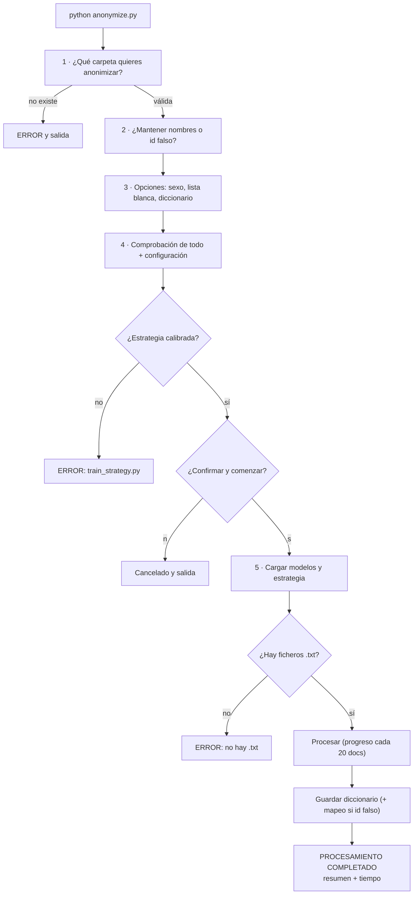

# carmina3-suite-v2

Suite de anonimización de notas clínicas en texto libre. Combina **expresiones regulares** (step2) y **modelos NER basados en BERT** (step3) para detectar información sensible, y la sustituye de forma **determinista mediante un diccionario de términos** (sin depender de un LLM local).

---

## Arquitectura

El sistema tiene **una única estrategia calibrada** que se aplica igual a cualquier documento:

1. **Base**: `step3` (BERT, token classification multiclase) detecta la mayoría de entidades y **determina su etiqueta**.
2. **Complemento**: `step2` (regex) añade entidades que `step3` pierde, pero solo donde la estrategia lo decide (por etiqueta).
3. **Filtro/booster**: `exp7` (regresión logística palabra a palabra sobre embeddings BSC) filtra falsos positivos y refuerza las detecciones de baja precisión.

La evaluación es **binaria a nivel de palabra (PHI vs no-PHI)**; la etiqueta concreta la asigna BERT.

### Componentes

| Componente | Descripción |
|---|---|
| `src/pipeline/step2_regex.py` | Detección por expresiones regulares (fechas, direcciones, horas, hospitales, nombres, teléfonos…) |
| `src/pipeline/step3_bert.py` | Detección con modelos BERT multiclase (`bsc-bio-ehr-es-carmen-anon`, `bsc-bio-ehr-es-meddocan`) |
| `src/pipeline/exp7.py` | Clasificador palabra a palabra (embeddings + regresión logística) |
| `src/pipeline/routing.py` | Calibración de la estrategia única (umbrales por etiqueta) y evaluación |
| `src/pipeline/predict.py` | Predictor final empaquetado (`Carma3`) |
| `src/pipeline/replace.py` | Sustitución por diccionario (`DictionaryReplacer`) |

### Dónde se usa la regresión logística (exp7)

La LR **no es un detector**: actúa solo como **filtro/booster a nivel de palabra**
durante la inferencia, dentro de `Carma3.detect()` en `src/pipeline/predict.py`.

- Se carga desde `src/routing/exp7_lr.joblib`, junto con su vocabulario
  (`exp7_words.json`) y las decisiones por etiqueta (`exp7_config.json`), en
  `Carma3._load_strategy()`.
- Solo puntúa las **etiquetas textuales**: `NAME`, `PROFESSIONAL`, `FAMILY`,
  `LOCATION`, `HOSPITAL`, `ORGANIZATION`, `PROFESSION`, `SEX`. Las numéricas
  (`DATE`, `TIME`, `AGE`, `PHONE`, `ID`, `EMAIL`, `URL`) **nunca** pasan por la LR.
- Sobre la base de `step3`: si la probabilidad de la palabra queda por debajo del
  umbral `filt` de su etiqueta, la palabra se **descarta** (elimina falsos positivos).
- Sobre las candidatas de `step2`: solo se **aceptan** si la probabilidad supera el
  umbral `add` de su etiqueta (cuando la estrategia lo requiere).
- La probabilidad se calcula con el embedding de la palabra, tomado de
  `exp7_w2v.npz` (caché) o calculado al vuelo con el embedder
  `bsc-bio-ehr-es-meddocan`.

### Etiquetas detectadas

`DATE`, `TIME`, `NAME`, `PROFESSIONAL`, `FAMILY`, `PROFESSION`, `AGE`, `SEX`, `LOCATION`, `HOSPITAL`, `ORGANIZATION`, `PHONE`, `EMAIL`, `URL`, `ID`, `OTHER`, `PHI`.

---

## Requisitos

- **Python 3.9+**
- **PyTorch** y **Transformers**
- Dependencias: `pip install -r requirements.txt`

### Verificación del entorno

Antes de nada, comprueba que tu máquina tiene todo lo necesario:

```bash
python tests/check_env.py
```

No prueba la aplicación: verifica Python, dependencias, GPU, modelos, estrategia
y ficheros de configuración, e imprime **qué arreglar** si algo falla. Sale con
código `0` si todo está listo y `1` si hay errores. Para una comprobación rápida
sin cargar los modelos: `python tests/check_env.py --quick`.

### Modelos BERT

Los modelos están en Hugging Face (`PlanTL-GOB-ES`, repositorios **gated**) y **no se versionan**. Descárgalos con:

```bash
python scripts/download_models.py
```

Deben quedar en `models/`, cada uno en su subdirectorio:

```
models/
├── bsc-bio-ehr-es-carmen-anon/   (multiclase)
└── bsc-bio-ehr-es-meddocan/      (multiclase + embedder de exp7)
```

### Estrategia calibrada

El predictor lee los artefactos de `src/routing/`:

```
src/routing/
├── exp7_config.json      ← decisiones por etiqueta (umbrales)
├── exp7_lr.joblib        ← regresión logística
├── exp7_words.json       ← vocabulario
└── exp7_w2v.npz          ← caché de embeddings (opcional, no versionada)
```

Solo el `exp7_w2v.npz` (caché de embeddings, cientos de MB) **no se versiona**:
si falta, se calcula al vuelo con el embedder (la primera ejecución es algo más
lenta). El resto (`exp7_config.json`, `exp7_lr.joblib`, `exp7_words.json`) sí va
versionado. Para regenerarlo todo:

```bash
python scripts/train_strategy.py
```

(equivale a `python -m src.pipeline.routing --class-weight 10`). Requiere los
datasets `datasets/meddocan.jsonl` y `datasets/griegos.jsonl`.

---

## Estructura del proyecto

```
anonymize.py               ← Orquestador principal (punto de entrada)
lista_blanca.txt           ← Términos que NO deben anonimizarse
dicc_sustituciones/        ← Opciones de reemplazo por etiqueta (editable)
requirements.txt
scripts/
├── download_models.py     ← Descarga los modelos BERT
└── train_strategy.py      ← Regenera la estrategia calibrada
tests/
├── check_env.py           ← Verificación previa del entorno (pre-flight)
└── test_environment.py    ← Test de entorno (opcional, requiere pytest)
models/                    ← Modelos BERT (no versionados)
datasets/                  ← Solo meddocan.jsonl (versionado); el resto no
src/
├── pipeline/              ← Pipeline del sistema
├── routing/               ← Estrategia calibrada (3 artefactos versionados; w2v no)
├── prepare/               ← Generación de datasets (dev)
└── utils/                 ← Verificación de datasets (dev)
```

---

## Uso

Ejecuta el orquestador desde la raíz:

```bash
python anonymize.py
```

El script guía paso a paso:

| Paso | Pregunta | Valor por defecto |
|---|---|---|
| 1 | ¿Qué carpeta quieres anonimizar? | — |
| 2 | ¿Mantenemos sus nombres en el output o les ponemos un id falso? | `s` (mantener) |
| 3 | ¿Anonimizamos el sexo? · ¿Usamos la lista blanca? · ¿Sustitución por diccionario? | `s` / `s` / `s` |
| 4 | Comprobación de todo + muestra de la configuración + confirmar | `s` |
| 5 | Ejecutar y reporte | — |

### Documentos de entrada

El script pide la **ruta de una carpeta** con los documentos a anonimizar
(p. ej. `datasets/para_anonimizar/`). Formato:

- **Un documento clínico por fichero `.txt` independiente**, codificación UTF-8.
- Se procesan todos los `*.txt` de la carpeta, en orden alfabético.
- En la salida puedes **conservar el nombre original** o asignar un **id falso**
  (`id_000001.txt`, `id_000002.txt`, ...) según lo elegido en el paso 2.

### Salida: dónde se guardan los resultados

Junto a la carpeta de entrada se generan:

| Fichero/Carpeta | Contenido |
|---|---|
| `{nombre}_FINAL/` | **Un `.txt` anonimizado por cada documento** (mismo nombre o id falso `id_000001.txt`, ...) |
| `{nombre}_diccionario.json` | Diccionario de términos original → sustituido (consistente entre ejecuciones) |
| `{nombre}_mapeo_nombres.json` | Solo si usas ids falsos: `id_000001.txt` → nombre original |

Ejemplo: si anonimizas `datasets/para_anonimizar/` (con `nota1.txt` y `nota2.txt`),
obtienes `datasets/para_anonimizar_FINAL/nota1.txt` y
`datasets/para_anonimizar_FINAL/nota2.txt` (con nombres conservados), o bien
`datasets/para_anonimizar_FINAL/id_000001.txt` e `id_000002.txt` (con ids falsos),
listos para usar.

### Flujo de ejecución (árbol de acciones)

Así avanza `anonymize.py` paso a paso:



En texto:

```
python anonymize.py
├── 1. ¿Qué carpeta quieres anonimizar?
│      ├── no existe ──▶ ERROR y salida
│      └── válida ──▶ continúa
├── 2. ¿Mantenemos sus nombres en el output o les ponemos un id falso?  (s/n)
├── 3. Opciones de anonimización:
│      ├── ¿Anonimizamos el sexo?  (s/n)
│      ├── ¿Usamos la lista blanca?  (s/n)
│      └── ¿Sustitución por diccionario?  (s/n, n = tags [ETIQUETA_n])
├── 4. Comprobación de todo + configuración
│      ├── sin estrategia ──▶ ERROR: python scripts/train_strategy.py
│      └── ¿Confirmar y comenzar? (s/n) ── n = "Cancelado." y salida
├── 5. Ejecutar y reporte
│      ├── no hay .txt ──▶ ERROR y salida
│      ├── procesa (avanza de 20 en 20 documentos)
│      ├── guarda diccionario (+ mapeo de nombres si ids falsos)
│      └── resumen final: nº de documentos + tiempo total
```

### Sustitución por diccionario (`dicc_sustituciones/`)

Cada etiqueta tiene un fichero de opciones (`NAME.txt`, `HOSPITAL.txt`, `DATE.txt`, ...) con una opción de reemplazo por línea. El sistema asigna las opciones de forma **cíclica**: términos distintos reciben valores distintos (variabilidad) y el mismo término recibe siempre el mismo valor (consistencia). El diccionario se persiste en disco para mantener la consistencia entre ejecuciones.

Los ficheros son **editables** (como `lista_blanca.txt`): se pueden añadir o quitar líneas para dar más variabilidad y dificultar la reversión del diccionario. Las líneas que empiezan por `#` son comentarios.

```
dicc_sustituciones/
├── DATE.txt          ← fechas falsas
├── TIME.txt
├── NAME.txt          ← nombres completos
├── PROFESSIONAL.txt  ← nombres de sanitarios
├── FAMILY.txt
├── PROFESSION.txt
├── AGE.txt
├── SEX.txt
├── LOCATION.txt      ← ciudades
├── HOSPITAL.txt      ← nombres de hospital
├── ORGANIZATION.txt
├── PHONE.txt
├── EMAIL.txt
├── URL.txt
├── ID.txt
├── OTHER.txt
└── PHI.txt
```

---

## Métricas

Evaluación binaria (PHI vs no-PHI) a nivel de palabra y a nivel de documento.
Estrategia única calibrada sobre meddocan+griegos.

### A nivel de palabra

| Dataset | Documentos | Precisión | Recall | F1 |
|---|---|---|---|---|
| meddocan (validación) | 100 | 0.875 | 0.940 | 0.906 |
| **carmen (test)** | **2000** | **0.930** | **0.919** | **0.924** |

### A nivel de documento

- **F1 macro**: media del F1 calculado documento a documento.
- **Fuga por documento**: % de documentos con al menos un falso negativo (PHI
  sin detectar) en etiquetas críticas: `EMAIL`, `FAMILY`, `NAME`, `ID`,
  `PHONE`, `URL`, `PROFESSIONAL`.

| Dataset | Documentos | F1 macro (media/doc) | Docs con fuga |
|---|---|---|---|
| **carmen (test)** | **2000** | **0.724** | **49 / 2000 (2.5%)** |

### Rendimiento

- **CARMEN (2000 documentos): 5 min 4 s** de procesamiento (detección + sustitución) Sin paralelización.

---

## Lista blanca (`lista_blanca.txt`)

Términos que **no deben anonimizarse** (siglas clínicas, abreviaturas, etc.). Un término por línea; las líneas con `#` son comentarios. Comparación insensible a mayúsculas.

La lista blanca se usa en dos puntos del sistema:
- **step3 (BERT)**: descarta falsos positivos (`is_false_positive`).
- **step2 (regex)**: evita marcar siglas clínicas como nombres (`MEDICAL_ACRONYMS`).

---

## Regenerar la estrategia (entrenamiento/calibración)

1. Descarga los modelos:

   ```bash
   python scripts/download_models.py
   ```

2. Genera los datasets unificados (solo si no existen):

   ```bash
   python -m src.prepare.unificar_datasets
   ```

3. Entrena el clasificador exp7 y calibra la estrategia única (regenera
   `exp7_w2v.npz` incluido):

   ```bash
   python scripts/train_strategy.py
   ```

3. (Opcional) Evalúa por componente o por dataset:

   ```bash
   python -m src.pipeline.routing --load --dataset carmen
   python -m src.pipeline.routing --load --dataset meddocan
   python -m src.pipeline.routing --load --dataset griegos
   ```
